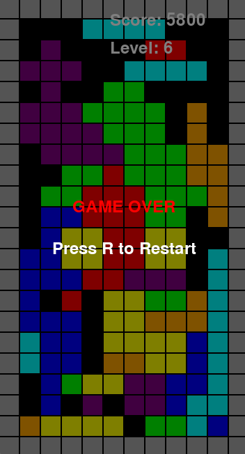

# Pygame Tetris

A classic Tetris implementation using Pygame.

## Requirements

- Python 3.8+
- Pygame 2.0+
- Pytest 7.0+ (for running tests)

## Installation

### Using pip

1. Clone this repository:
```bash
git clone https://github.com/marccodess/pygame-tetris.git
cd pygame-tetris
```

2. Install the required dependencies:
```bash
pip install -r requirements.txt
```

### Using Poetry (recommended)

1. Clone this repository:
```bash
git clone https://github.com/marccodess/pygame-tetris.git
cd pygame-tetris
```

2. Install Poetry if you haven't already:
```bash
curl -sSL https://install.python-poetry.org | python3 -
```

3. Create and activate virtual environment:
```bash
poetry config virtualenvs.in-project true
poetry init
poetry add $(cat requirements.txt)
poetry install
poetry shell
```

## Running Tests

To run the test suite:
```bash
python -m pytest tests/
```

For verbose output:
```bash
python -m pytest -v tests/
```

To run a specific test file:
```bash
python -m pytest tests/test_game.py
```

To see test coverage:
```bash
python -m pytest --cov=src tests/
```

## How to Play

1. Start the game by running:
```bash
python main.py
```

2. Controls:
- ←/→: Move piece left/right
- ↓: Soft drop
- ↑: Rotate piece clockwise
- Z: Rotate piece counter-clockwise
- SPACE: Hard drop
- P: Pause game
- ESC: Quit game
- R: Restart game (when game over)

## Game Features

- Classic Tetris gameplay
- Score tracking
- Level progression
- Next piece preview
- Line clear animations
- High score saving

## Game Preview



## Contributing

Feel free to open issues or submit pull requests if you'd like to contribute to the project.